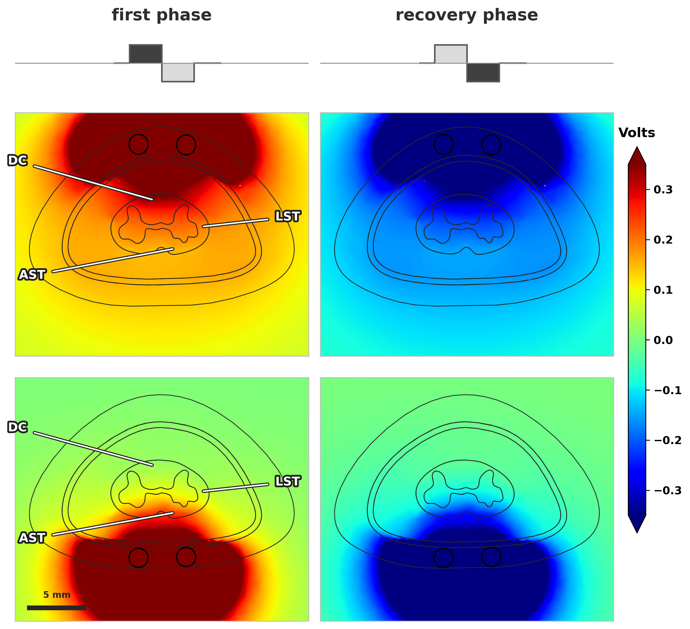
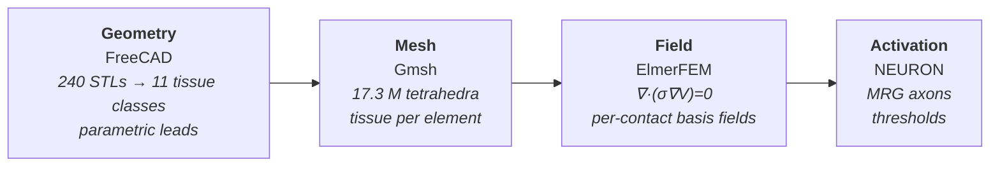

# Computational modelling of dorsal and ventral spinal cord stimulation

An open-source forward model of spinal cord stimulation (SCS): anatomy in
FreeCAD, meshing in Gmsh, quasi-static field solution in ElmerFEM, and
multicompartment axon models in NEURON.

**The question.** SCS has been applied almost exclusively to the dorsal columns
since 1967, yet its mechanism remains contested and real-world effectiveness is
near 40%. A small clinical literature — including a case series from our own
group — reports that _ventral_ lead placement helps some patients more. Nobody
knows why.

**The claim this model can falsify.** The leading hypothesis is that dorsal
stimulation reaches the spinothalamic pain pathways only _transsynaptically_,
while ventral stimulation reaches them directly. Distinguishing those
experimentally is hard, because a signal recorded on a distant lead could be a
relay, or could be nothing more than current spreading through cerebrospinal
fluid. **This model has no synapses.** It therefore computes exactly the null
hypothesis the experiment cannot isolate: _how much cross-column activation is
explicable by volume conduction and direct axonal excitation alone?_ Where the
model says "none" and the recording says "something", the relay is real.



_Axial sections through the driven contacts of each lead, same 20 mA bipolar
montage, both phases of a 220 µs/90 Hz biphasic pulse. Columns are the two
waveform phases; rows are the two placements. DC, LST and AST mark the dorsal
column and the lateral and anterior spinothalamic tracts — anatomical
landmarks, not separately modelled compartments. Colour is clipped to the
white-matter range (±0.35 V) against a true peak of 7.26 V, so the epidural
space saturates._

---

## The pipeline



Each stage is defined by the **artifact** it produces, not by the tool that
produces it: labelled geometry → mesh with per-element labels → basis fields →
thresholds. Every artifact carries a manifest and a content signature, and each
stage refuses a stale or partial input rather than silently consuming it. That
is what makes the tools replaceable.

**One design decision matters more than the rest.** The field is solved once per
contact at 1 A, with the return current spread over the insulating outer
boundary. Any zero-net-current montage is then the linear combination
`V = Σᵢ Iᵢ φᵢ`. Changing which contacts are driven, or by how much, is a
weighted sum and costs nothing; only a change in _geometry_ costs a solve. This
is why an interactive field viewer is possible on top of a 2.6-hour solve.

## Results

Two placements, identical montage (10 mA per contact, 20 mA total, 220 µs per
phase at 90 Hz), each lead modelled at the level it would clinically occupy.

|                                         | dorsal lead (T12)                 | ventral lead (T10)     |
| --------------------------------------- | --------------------------------- | ---------------------- |
| mesh                                    | 2,855,592 nodes / 17,334,566 tets | 2,853,475 / 17,322,431 |
| solve                                   | 2.64 h on 14 cores                | 2.52 h                 |
| contact → cord surface                  | 3.53 mm                           | 2.56 mm                |
| contact → modelled dorsal-column fibres | 4.9 mm                            | 7.6 mm                 |
| Aβ threshold, 0.5 mm deep               | 12.5 – 13.1 mA                    | 72.2 – 75.3 mA         |
| Aβ threshold, 1.2 mm deep               | 19.3 – 19.8 mA                    | 43.8 – 44.0 mA         |

The result worth keeping is not the ratio but its **reversal with depth**: going
deeper moves a fibre away from a dorsal lead but _toward_ a ventral one, so the
ratio falls from ~5.8× at 0.5 mm to ~2.2× at 1.2 mm. The geometry predicts the
sign change and the simulation reproduces it independently at both lateral
offsets, which is hard to obtain by accident.

A frequently assumed mechanism does **not** hold in this anatomy: the cord sits
nearly centred in the thecal sac (2.80 mm of CSF dorsally against 2.63 mm
ventrally), so the textbook "thicker dorsal CSF" asymmetry is absent. What
differs is which part of the cord each lead faces.

## Verification

| check                                                    | result                                                                       |
| -------------------------------------------------------- | ---------------------------------------------------------------------------- |
| Two independently written solvers, same mesh and montage | agree to 9.1×10⁻³ V over a 2667.6 V range — **0.0003%**                      |
| Floating contacts                                        | net current and equipotentiality **measured** per solve, not assumed         |
| Gauge pin                                                | current reaction reported as a fraction of 1 A, confirming it carries none   |
| Peak \|E\| in white matter vs Khadka et al. 2020         | 11.51 kV/m vs 12 kV/m (**on an earlier 6-compartment model**, not the above) |

That last row is deliberately scoped. In the same comparison grey matter came
out 1.9× high — the direction isotropic white matter predicts, since without a
longitudinal shunt more current crosses into the grey horns instead of running
along the columns. A known simplification predicting the direction of its own
error is the most informative thing in the table.

## What is approximate

Stated plainly, because the limits decide what the model may be used for.

- **White matter is isotropic** at 0.1432 S/m, the transverse value. Khadka uses
  0.1432 transverse / 0.6 longitudinal. This matters most for exactly the
  cross-column recruitment question above, and is the first thing to fix.
- **Interfaces are resolved to element size, not followed exactly.** The source
  STLs are not tessellated compatibly at shared boundaries — dura and epidural
  share 4 vertices out of ~1780 — so no conformal mesh can be built by
  stitching them. The pipeline sidesteps this with a box mesh and point-in-shell
  classification. Rebuilding the anatomy is tracked on the `cad-dev` branch.
- **Mesh convergence has not been run** on the two models above.
- **Fibre trajectories are geometry-verified but not anatomically reviewed**
  (`anatomically_validated: false` in every trajectory file).
- One healthy anatomy, a fixed cord, no peri-electrode scar, no
  electrode–tissue interface model.

Longer list, with evidence: [`fem/README.md`](fem/README.md).

## Repository map

| path                                    | what                                              |
| --------------------------------------- | ------------------------------------------------- |
| [`fem/`](fem/README.md)                 | meshing, solver, montage, FreeCAD dock panels     |
| [`src/neuron/`](src/neuron/README.md)   | axon models, field sampling, threshold search     |
| [`src/freecad/`](src/freecad/README.md) | Lead Designer — parametric leads with a fit check |
| [`src/ansys/`](src/ansys/README.md)     | earlier Ansys route, kept as a validation target  |
| [`STL_files/`](STL_files/)              | RADO-SCS 3.0 source geometry, 245 STLs            |
| [`HANDOFF.md`](HANDOFF.md)              | current state and where to start                  |
| [`fem/TODO.md`](fem/TODO.md)            | open technical items, with reasoning              |

## Running it

```bash
python -m venv fem/.venv && fem/.venv/bin/pip install -r fem/requirements.txt
bash fem/run_all.sh          # mesh, solve, export; writes to fem/out/
```

ElmerSolver needs `ELMER_HOME` and `ELMER_SOLVER_HOME` set, not just `PATH`, or
it fails on `elements.def not found`. The FreeCAD panels are macros under
`fem/scripts/`; see [`fem/README.md`](fem/README.md) for installation.

## Built on

The anatomy is **RADO-SCS 3.0** (Khadka et al. 2020), distributed as STL
geometry; its own documentation lists an open-source current-flow platform
as future work. This repository is an attempt at that platform.

1. N. Khadka et al., "Realistic anatomically detailed open-source spinal cord
   stimulation (RADO-SCS) model," _J. Neural Eng._ 17(2):026033, 2020.
   [doi:10.1088/1741-2552/ab8344](https://doi.org/10.1088/1741-2552/ab8344)
2. C. Geuzaine and J.-F. Remacle, "Gmsh: a three-dimensional finite element mesh
   generator with built-in pre- and post-processing facilities," _Int. J. Numer.
   Methods Eng._ 79(11):1309–1331, 2009.
   [doi:10.1002/nme.2579](https://doi.org/10.1002/nme.2579)
3. M. Malinen and P. Råback, "Elmer finite element solver for multiphysics and
   multiscale problems," in _Multiscale Modelling Methods for Applications in
   Materials Science_, IAS Series vol. 19, Forschungszentrum Jülich, 2013,
   pp. 101–113.
4. G. M. Van Acker et al., "Ventral column spinal cord stimulation for
   refractory back and leg pain: a case series," _Am. J. Phys. Med. Rehabil._
   105(3S), 2026.
   [doi:10.1097/PHM.0000000000002779](https://doi.org/10.1097/PHM.0000000000002779)

Model geometry is CC BY 4.0 from the RADO-SCS release.
